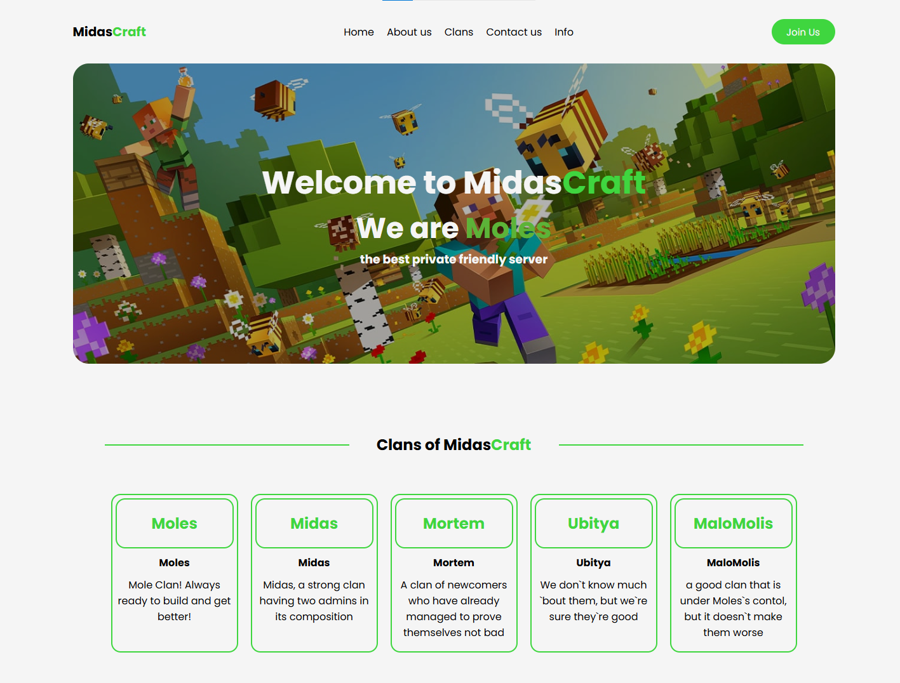

#MidasCraft: 
The website was made for a friendly minecraft server using node.js, express, nodeMailer, js, handle-bars👏

<a href='https://midascraft-backend-frontend.onrender.com/#logo' style='display:inline-block; color:white; background-color:green; padding:10px 15px; border-radius:15px'>Check</a>
<a href="https://example.com" target="_blank" style="
    display: inline-block;
    padding: 10px 20px;
    background-color: #4CAF50;
    color: #fff;
    border-radius: 25px;
    text-decoration: none;
    font-weight: bold;
">Нажми меня</a>

